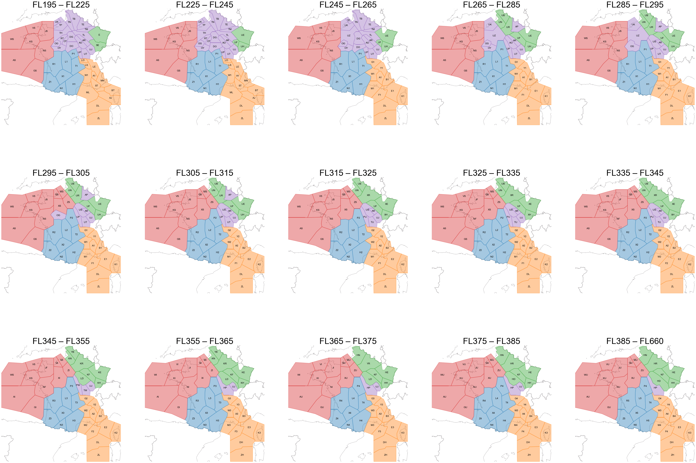
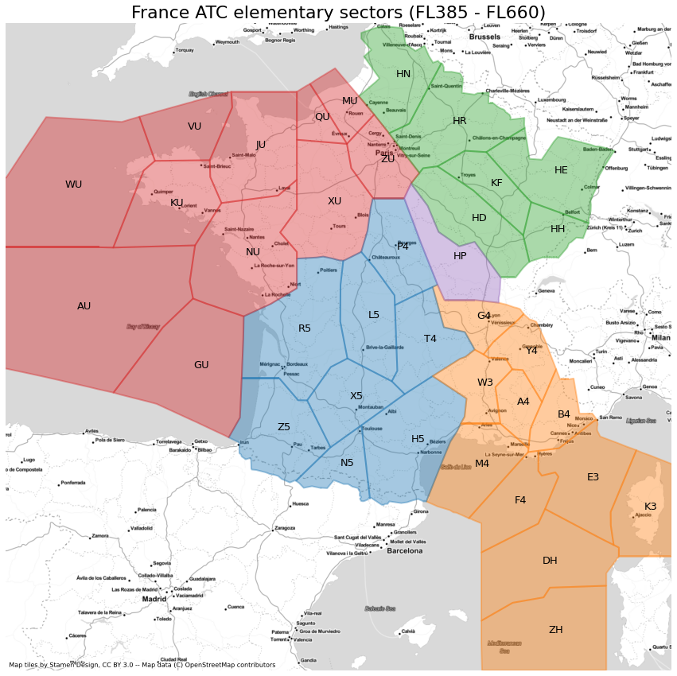

# French ATC elementary sectors

Determine and plot all the different partitions of ATC elementary sectors in France above FL195 with traffic library

Example: plot all different partitions between FL195 and FL660 

Example: plot one partition at a given layer with a background map

## Running the tests

Run the notebook french_elementary_sectors 

## Built With

On top of classical Python libraries (e.g. matplotlib), the following libraries are used:
* [traffic library](https://github.com/xoolive/traffic) - Air traffic data processing in Python
* [contextily](https://github.com/darribas/contextily) - Context geo-tiles in Python

## Versions

This code was tested with following versions:
* Python 3.9.4
* traffic 2.6.4
* contextily 1.1.0

## Authors

* **Thomas Dubot** 

## License

This project is licensed under the MIT License - see the [LICENSE.md](LICENSE.md) file for details

